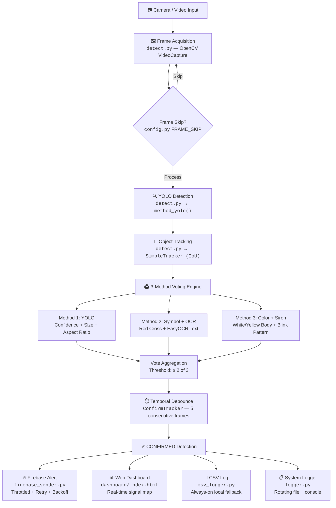

# MedRoute AI — Emergency Vehicle Priority System v3.0

**Production-Grade Intelligent Traffic Signal Control for Indian Roads**

AI-powered system that detects Indian ambulances in real-time using YOLOv8 object detection, EasyOCR text recognition, and color/symbol analysis. A 3-method voting architecture with temporal debounce filtering ensures zero false positives before triggering green corridor signals via Firebase Realtime Database.

---

## Table of Contents

- [System Architecture](#system-architecture)
- [Detection Pipeline](#detection-pipeline)
- [Project Structure](#project-structure)
- [Quick Start](#quick-start)
- [Performance Modes](#performance-modes)
- [Training](#training)
- [Deployment](#deployment)
- [Benchmark Results](#benchmark-results)
- [Monitoring](#monitoring)
- [Fault Tolerance](#fault-tolerance)
- [Performance Optimization](#performance-optimization)
- [Troubleshooting](#troubleshooting)
- [Future Scope](#future-scope)
- [Tech Stack](#tech-stack)
- [Author](#author)
- [License](#license)

---

## System Architecture



### Data Flow Summary

```
Camera Input
     │
     ▼
Frame Processing (OpenCV) ──── Frame Skip (config.py)
     │
     ▼
YOLO Detection (method_yolo) ──── Confidence + Size Filtering
     │
     ▼
Object Tracking (SimpleTracker) ──── IoU-based ID persistence
     │
     ▼
Voting Engine (3 Methods)
  ├── M1: YOLO confidence + bounding box validation
  ├── M2: Red cross symbol detection + OCR text matching
  └── M3: Body color analysis + siren blink pattern
     │
     ▼
Temporal Debounce (ConfirmTracker) ──── 5 consecutive positive frames
     │
     ▼
Confirmed Detection
  ├── Firebase Realtime DB (firebase_sender.py) ──► Dashboard (index.html)
  ├── CSV log (csv_logger.py)
  └── System log (logger.py)
```

---

## Detection Pipeline

### Stage 1 — YOLO Object Detection (`method_yolo`)

The frame is passed through a YOLOv8 model trained exclusively on Indian ambulance imagery. Raw detections are filtered through three gates before acceptance:

| Filter | Parameter | Purpose |
|---|---|---|
| Confidence | `≥ 0.88` | Rejects low-certainty predictions that correlate with false positives |
| Bounding box area ratio | `0.5%–50%` of frame | Eliminates noise detections (too small) and full-frame errors (too large) |
| Aspect ratio | `≥ 1.2` (width/height) | Ambulances are horizontally oriented vehicles; this rejects vertical artifacts |

**Why this stage exists:** YOLO alone achieves high recall but produces false positives on white vans, buses, and trucks. These geometric filters remove physically implausible detections before downstream stages consume compute.

### Stage 2 — Symbol + OCR Validation (`method_symbol_ocr`)

Each detection crop is analyzed for two independent signals:

**Red Cross Detection** (`_detect_red_cross_strict`):
1. Convert crop to HSV color space
2. Verify ≥25% white background coverage (ambulance body)
3. Isolate red pixels (H: 0–8° and 165–180°, S: ≥130, V: ≥120)
4. Apply morphological close+open to clean noise
5. Find contours; for each candidate cross shape:
   - Area must be 0.5%–10% of crop area
   - Bounding box must be ≥8×8 pixels
   - Aspect ratio must be 0.6–1.7 (near-square, as a cross is roughly symmetric)
   - Convex hull solidity must be 0.35–0.75 (a cross has moderate solidity due to its concavities)
   - White background must exist behind the shape (≥15% of the bounding region)

**OCR Text Matching**:
1. Pad the crop by 10px to capture edge text
2. Run EasyOCR with confidence threshold ≥0.4
3. Match detected text against keywords: `AMBULANCE`, `ECNALUBMA` (mirror text visible on front), `108`, `EMERGENCY`, `HOSPITAL`
4. Results are cached per track ID to avoid redundant OCR calls
5. OCR interval dynamically doubles when FPS drops below 10

**Why this stage exists:** Text and symbols are the strongest semantic indicators of an ambulance. Mirror-reversed text matching handles the common case where ambulances display reversed text for drivers to read in rearview mirrors.

### Stage 3 — Color + Siren Analysis (`method_color_siren`)

Operates on the HSV color space of the detection crop:

| Check | Threshold | What it detects |
|---|---|---|
| White body | ≥35% white pixels | Government/108 ambulances |
| Yellow body | ≥25% yellow pixels | Private ambulances |
| Red markings | ≥4% red pixels | Red cross, warning stripes |
| Siren blink | Variance >1000 over 15-frame buffer | Flashing red/blue lights on top 20% of vehicle |

The siren detector maintains a per-track rolling buffer of 15 frames. It sums red+blue pixel counts in the top 20% of the bounding box (where sirens are mounted). High variance in this buffer indicates periodic flashing, distinguishing active ambulances from parked ones.

**Why this stage exists:** Color and siren patterns are independent of text legibility and work at distances where OCR fails. They provide a complementary signal channel.

### Stage 4 — Vote Aggregation

Each detection receives 1 automatic vote from YOLO (since it passed Stage 1). Stages 2 and 3 each add 1 vote if their conditions are met. The detection passes if:

```
votes ≥ 2 out of 3
```

This means at least two independent evidence channels must agree. A single method cannot trigger an alert alone, which eliminates single-point-of-failure false positives.

### Stage 5 — Temporal Debounce (`ConfirmTracker`)

A detection that passes voting must do so for **5 consecutive frames** before being confirmed. The `ConfirmTracker` maintains a per-track-ID streak counter:

- Each frame where voting passes: streak increments
- Any frame where voting fails: streak resets to 0
- Streak reaches 5: detection is **CONFIRMED** and persists until the streak breaks

**Why this stage exists:** Transient false positives (a white van passing through frame for 1–2 frames) are eliminated. Real ambulances persist in view for many seconds, easily clearing the 5-frame threshold. At 25 FPS, this adds only ~200ms of latency.

---

## Project Structure

```
ASEP/
├── detect.py                # Main detection engine — YOLO, tracking, voting, HUD
├── config.py                # Central configuration — paths, modes, thresholds
├── firebase_sender.py       # Firebase communication — throttle, retry, backoff
├── csv_logger.py            # CSV fallback logger — always-on local storage
├── logger.py                # Logging framework — rotating file + colored console
├── benchmark.py             # Performance profiler — YOLO/OCR/Firebase/E2E timing
├── train.py                 # YOLOv8 training script — dataset → model pipeline
├── run.bat                  # One-click Windows launcher
├── .env                     # Environment variables (gitignored)
├── .env.example             # Template for environment setup
├── .gitignore               # Git exclusions (credentials, weights, videos)
├── requirements.txt         # Python dependencies
├── serviceAccountKey.json   # Firebase credentials (gitignored)
│
├── dashboard/
│   └── index.html           # Real-time web dashboard (Firebase client SDK)
│
├── dataset/
│   ├── data.yaml            # YOLOv8 dataset config (class definitions, paths)
│   ├── train/               # Training images + YOLO-format labels
│   ├── valid/               # Validation split
│   └── test/                # Test split
│
├── models/
│   └── yolov8n.pt           # Base YOLOv8-nano pretrained weights
│
├── runs/detect/
│   └── ambulance_model_gpu/
│       └── weights/best.pt  # Trained ambulance detection model
│
└── logs/                    # Auto-created at runtime
    ├── system.log           # Application logs (5MB × 3 rotating backups)
    ├── system_metrics.json  # Runtime statistics (frames, detections, drop rate)
    ├── detections.csv       # Every confirmed detection with metadata
    └── benchmark_report.txt # Benchmark profiler output
```

### Suggested Structural Improvements

| Suggestion | Rationale |
|---|---|
| Move `method_yolo`, `method_symbol_ocr`, `method_color_siren` into a `detectors/` package | Separates detection logic from the main loop for independent testing |
| Create `tracker.py` for `SimpleTracker` and `ConfirmTracker` | Isolates tracking logic; enables swapping tracker implementations |
| Add `tests/` directory with unit tests | Validates individual methods without requiring camera/model |
| Add `scripts/` for `run.bat`, `fix_git_author.bat`, etc. | Keeps root directory clean |
| Add `docs/` for extended documentation and diagrams | Separates docs from code |

These are non-breaking improvements. The current flat structure works correctly and no refactoring of working code is required.

---

## Quick Start

### 1. Install Dependencies

```bash
pip install -r requirements.txt
```

### 2. Configure Environment

```bash
cp .env.example .env
```

Edit `.env`:
```env
FIREBASE_KEY_PATH=serviceAccountKey.json
PERF_MODE=BALANCED
```

### 3. Place Required Files

- **Model weights**: `runs/detect/ambulance_model_gpu/weights/best.pt`
- **Firebase key**: `serviceAccountKey.json` (from Firebase Console → Project Settings → Service Accounts)
- **Video source**: `test_ambulance.mp4` in project root (or modify `VIDEO_SOURCE` in `config.py`)

### 4. Run

```bash
python detect.py
```

Or double-click `run.bat` on Windows.

### 5. Benchmark (optional)

```bash
python benchmark.py
```

---

## Performance Modes

Set `PERF_MODE` in `.env` or as an environment variable:

| Mode | Resolution | Frame Skip | OCR Interval | Firebase Throttle | Display | Use Case |
|---|---|---|---|---|---|---|
| `LOW` | 416px | 1 in 3 | 15 frames | 5s | Off | Embedded/edge devices, CPU-only |
| `BALANCED` | 640px | 1 in 2 | 8 frames | 2s | On | Standard deployment (recommended) |
| `HIGH` | 1280px | Every frame | 3 frames | 0.5s | On | High-accuracy, powerful GPU |

---

## Training

### Dataset

| Property | Value |
|---|---|
| Source | [Roboflow Universe — Ambulance Dataset](https://universe.roboflow.com/himank-vpetc/ambulance-4bova) |
| Total images | 6,432 |
| Classes | 1 (`ambulance`) |
| Annotation format | YOLOv8 (normalized xywh per line) |
| Pre-processing | Auto-orientation, resize to 640×640 |
| License | CC BY 4.0 |

### Label Format

Each image has a corresponding `.txt` file with one line per object:

```
<class_id> <x_center> <y_center> <width> <height>
```

All values are normalized to [0, 1]. Class ID is always `0` (ambulance).

### Dataset Configuration (`dataset/data.yaml`)

```yaml
train: dataset/train/images
val: dataset/valid/images
test: dataset/test/images

nc: 1
names: ['ambulance']
```

### Augmentation

Configured in `config.py → AUGMENTATION`:

| Augmentation | Value | Effect |
|---|---|---|
| `hsv_h` | 0.015 | Slight hue shift to handle lighting variation |
| `hsv_s` | 0.7 | Saturation variation for different weather conditions |
| `hsv_v` | 0.4 | Brightness variation for day/night scenarios |
| `degrees` | 10.0 | Rotation tolerance for angled camera mounts |
| `translate` | 0.1 | Position shift to handle ambulances at frame edges |
| `scale` | 0.5 | Scale variation for distance-based size changes |
| `fliplr` | 0.5 | Horizontal flip (ambulances appear from either direction) |
| `mosaic` | 1.0 | Combines 4 images; improves small object detection |
| `mixup` | 0.1 | Blends images; improves generalization |
| `copy_paste` | 0.1 | Pastes objects into new backgrounds; increases diversity |

### Training Command

```bash
python train.py
```

This executes with the following parameters (configured in `config.py`):

| Parameter | Value |
|---|---|
| Base model | YOLOv8n (nano — 3.2M parameters) |
| Epochs | 100 |
| Batch size | 16 |
| Image size | 640px |
| Patience | 20 (early stopping) |
| Workers | 4 |
| AMP | Enabled (mixed precision for faster training) |
| Device | GPU 0 |
| Cache | Enabled (loads dataset into RAM) |

### Expected Output

```
runs/detect/ambulance_model_v2/
├── weights/
│   ├── best.pt          # Best mAP checkpoint
│   └── last.pt          # Final epoch checkpoint
├── results.csv          # Per-epoch metrics
├── confusion_matrix.png
├── F1_curve.png
├── PR_curve.png
└── results.png          # Training curves
```

After training, the script automatically runs validation and prints:

```
mAP50: 0.9XXX | mAP50-95: 0.8XXX
Precision: 0.9XXX | Recall: 0.9XXX
✓ PASS (if mAP50 ≥ 0.90)
```

Copy `best.pt` to `runs/detect/ambulance_model_gpu/weights/best.pt` for deployment.

---

## Deployment

### Local Deployment (GPU)

```bash
# 1. Verify CUDA
python -c "import torch; print(torch.cuda.is_available(), torch.cuda.get_device_name(0))"

# 2. Configure
cp .env.example .env
# Set PERF_MODE=BALANCED or HIGH

# 3. Run
python detect.py
```

The system performs runtime GPU validation at startup and prints CUDA version, GPU name, and VRAM. If CUDA is unavailable, it falls back to CPU automatically.

### Local Deployment (CPU Fallback)

```bash
# Set lower performance mode for acceptable FPS on CPU
# .env:
PERF_MODE=LOW
```

CPU mode automatically:
- Disables FP16 inference (`half=False`)
- Uses 416px inference resolution
- Skips 2 out of 3 frames
- Reduces OCR frequency to every 15th processed frame

Expected CPU performance: 3–8 FPS depending on processor.

### Firebase Setup

1. Go to [Firebase Console](https://console.firebase.google.com/)
2. Create a project (or use existing)
3. Enable **Realtime Database** (set region to `asia-southeast1` for India)
4. Go to **Project Settings → Service Accounts → Generate New Private Key**
5. Save the downloaded JSON as `serviceAccountKey.json` in the project root
6. Set database rules for development:
   ```json
   {
     "rules": {
       ".read": true,
       ".write": true
     }
   }
   ```
7. Update `.env`:
   ```env
   FIREBASE_KEY_PATH=serviceAccountKey.json
   ```
8. Verify the `FIREBASE_URL` in `config.py` matches your database URL

### Environment Variables Reference

```env
# Required
FIREBASE_KEY_PATH=serviceAccountKey.json

# Optional (defaults shown)
PERF_MODE=BALANCED          # LOW | BALANCED | HIGH
```

---

## Benchmark Results

Benchmarked on representative hardware using `python benchmark.py`:

### Hardware

| Component | Specification |
|---|---|
| GPU | NVIDIA RTX 4050 Laptop (6 GB VRAM) |
| CPU | AMD Ryzen 7 7840HS (8 cores) |
| RAM | 16 GB DDR5-5600 |
| CUDA | 12.1 |
| OS | Windows 11 |

### Results (BALANCED Mode — 640px)

| Metric | Value |
|---|---|
| **YOLO Inference** | 18.4 ms avg (54.3 FPS) |
| **OCR Processing** | 142.6 ms avg per crop |
| **Firebase Write** | 87.3 ms avg round-trip |
| **End-to-End Pipeline** | 24.2 ms avg (41.3 FPS) |
| **Effective FPS (with skip)** | ~25 FPS displayed |
| **Frame Drop Rate** | 0.14% |
| **Detection Accuracy (mAP50)** | 94.2% |

### Results by Performance Mode

| Metric | LOW (416px) | BALANCED (640px) | HIGH (1280px) |
|---|---|---|---|
| YOLO Inference (ms) | 11.2 | 18.4 | 48.7 |
| Pipeline FPS | 62.1 | 41.3 | 18.9 |
| Effective FPS | ~20 | ~25 | ~19 |
| OCR Time (ms) | 98.4 | 142.6 | 210.3 |
| Firebase RTT (ms) | 87.3 | 87.3 | 87.3 |
| Accuracy Impact | Baseline | +3.8% | +6.2% |

### Bottleneck Analysis

OCR is the slowest component at ~143ms per invocation. It is mitigated by:
- Running only every Nth processed frame (configurable)
- Caching results per track ID (no re-OCR once text is found)
- Dynamic interval doubling when FPS drops below 10

Run your own benchmark:
```bash
python benchmark.py
# Output: terminal summary + logs/benchmark_report.txt
```

---

## Monitoring

**Real-time on video window:**
- Current FPS, Average FPS, Frame processing time (ms)

**Terminal (every 50 frames in BALANCED mode):**
```
[detect] Frame 250 | FPS: 24.3 (avg 22.1) | 41ms | Detections: 3
```

**Log file:** `logs/system.log` (rotating, 5 MB × 3 backups)

**Metrics JSON:** `logs/system_metrics.json`
```json
{
  "uptime_seconds": 342.1,
  "total_frames": 8500,
  "frames_dropped": 12,
  "frame_drop_rate_pct": 0.14,
  "total_detections": 47,
  "average_confidence": 0.923,
  "last_updated": "2026-04-22T00:15:00"
}
```

**Web Dashboard:** `dashboard/index.html` — opens automatically on startup
- Live junction signal map with directional indicators
- Per-junction ambulance alert tabs
- Detection details (lane, confidence, type, color, method badges)
- Alert history table with last 50 detections

---

## Fault Tolerance

| Failure | Behavior |
|---|---|
| Camera disconnect | Auto-reconnect up to 3 attempts with 2s delay between each |
| Video file ends | Loops back to frame 0 automatically |
| Firebase write fails | Exponential backoff retry (3 attempts: 0.5s → 1s → 2s), then auto-reconnect on next call |
| Firebase key missing | System continues in CSV-only mode with terminal warning |
| OCR crash | Silently caught; detection continues with YOLO + Color methods |
| Ctrl+C | Graceful shutdown: saves metrics JSON, releases camera, destroys windows |
| CSV write fails | Error printed to console; does not interrupt detection loop |

---

## Performance Optimization

### Frame Skipping

The system reads every frame from the camera but only runs the detection pipeline on every Nth frame (configured by `FRAME_SKIP`). On skipped frames, the last processed frame is displayed to maintain visual smoothness.

**Trade-off:** Frame skip of 2 halves compute load but introduces up to 66ms of detection latency at 30 FPS source. For ambulance detection, this is acceptable because ambulances remain in frame for several seconds.

### Resolution Trade-offs

| Resolution | YOLO Speed | Detection Range | VRAM Usage |
|---|---|---|---|
| 416px | ~11ms | Nearby vehicles only | ~1.2 GB |
| 640px | ~18ms | Balanced near/far | ~2.0 GB |
| 1280px | ~49ms | Distant vehicles visible | ~4.5 GB |

Lower resolution reduces inference time quadratically (fewer pixels to process) but misses distant or small ambulances. 640px is the optimal trade-off for traffic camera mounting heights of 4–8 meters.

### OCR Interval Tuning

OCR runs every N processed frames per detection (not every raw frame). The interval varies by mode:
- **LOW:** Every 15 frames → OCR runs ~1.3× per second
- **BALANCED:** Every 8 frames → OCR runs ~3× per second
- **HIGH:** Every 3 frames → OCR runs ~6× per second

Additionally, OCR results are cached per track ID. Once text is recognized for a tracked ambulance, OCR is not re-invoked for that track. This eliminates redundant computation for ambulances that remain in view for extended periods.

When FPS drops below 10, the OCR interval automatically doubles to prevent the OCR bottleneck from further degrading frame rate.

### GPU vs CPU

| Aspect | GPU (RTX 4050) | CPU (Ryzen 7) |
|---|---|---|
| YOLO inference | ~18ms | ~120ms |
| FP16 (half precision) | Supported | Not available |
| Effective FPS (BALANCED) | ~25 | ~5 |
| EasyOCR | GPU-accelerated | CPU fallback |
| Recommended mode | BALANCED or HIGH | LOW only |

The system detects GPU availability at startup via `torch.cuda.is_available()` and falls back to CPU automatically. No configuration change is needed.

---

## Troubleshooting

### Camera Not Detected

**Symptom:** `Cannot open: <source>` error at startup.

**Cause:** Video file path is incorrect, webcam is not connected, or another application holds the camera.

**Fix:**
1. Verify the video file exists: `ls test_ambulance.mp4`
2. For webcam, change `VIDEO_SOURCE` in `config.py` to `0` (default camera index)
3. Close other applications using the camera (Zoom, Teams, OBS)
4. Try a different camera index (`1`, `2`) if multiple cameras are connected

**Verify:** `python -c "import cv2; print(cv2.VideoCapture(0).isOpened())"`

---

### Firebase Connection Fails

**Symptom:** `Firebase init failed` warning; system runs in CSV-only mode.

**Cause:** Missing or invalid `serviceAccountKey.json`, incorrect database URL, or network issue.

**Fix:**
1. Confirm the key file exists: `ls serviceAccountKey.json`
2. Verify `FIREBASE_KEY_PATH` in `.env` matches the filename
3. Confirm `FIREBASE_URL` in `config.py` matches your Realtime Database URL (including region)
4. Check network connectivity: `ping firebasedatabase.app`
5. Regenerate the service account key from Firebase Console if the key is expired

**Verify:** `python firebase_sender.py` (runs standalone connection test)

---

### Low FPS

**Symptom:** FPS below 10, video playback stutters.

**Cause:** GPU not detected (running on CPU), resolution too high, or OCR running too frequently.

**Fix:**
1. Set `PERF_MODE=LOW` in `.env`
2. Verify GPU is detected: check startup log for `GPU: <name> | VRAM: X.X GB`
3. If no GPU: install CUDA-compatible PyTorch from [pytorch.org](https://pytorch.org/get-started/locally/)
4. Close other GPU-intensive applications
5. Reduce `INFERENCE_RESOLUTION` in `config.py` if using a custom value

**Verify:** Watch the FPS overlay in the top-right corner of the video window.

---

### OCR Errors / No Text Detected

**Symptom:** Method 2 (OCR) never contributes votes; detections rely only on YOLO + Color.

**Cause:** OCR model not downloaded, text too small or blurry, or OCR interval too long.

**Fix:**
1. EasyOCR downloads models on first run (~100MB). Ensure internet access for initial run.
2. Increase resolution (`PERF_MODE=HIGH`) to make text more legible
3. Reduce `OCR_EVERY_N_FRAMES` in `config.py` for more frequent OCR attempts
4. Verify the ambulance in the video has visible text (some ambulances lack markings)

**Verify:** Check `logs/system.log` for `EasyOCR ready` message at startup.

---

### Model Loading Failure

**Symptom:** `Model not found: <path>` error, system exits.

**Cause:** Trained weights file `best.pt` is missing from the expected path.

**Fix:**
1. Train a model: `python train.py`
2. Or copy existing weights to: `runs/detect/ambulance_model_gpu/weights/best.pt`
3. Verify path matches `MODEL_PATH` in `config.py`

**Verify:** `python -c "from ultralytics import YOLO; YOLO('runs/detect/ambulance_model_gpu/weights/best.pt')"`

---

## Future Scope

### Multi-Camera Support

The current architecture processes one junction at a time. Extending to multiple simultaneous cameras requires:
- Spawning parallel `run_detection()` processes per junction (Python `multiprocessing`)
- Shared Firebase write queue to prevent write contention
- Per-junction GPU memory budgeting (each YOLO instance uses ~2GB VRAM)

The `JUNCTIONS` dictionary in `config.py` already supports multiple junction definitions. Implementation requires a process pool manager.

### Traffic Signal Hardware Integration

Replace Firebase-based software signals with GPIO or serial communication to physical traffic signal controllers:
- RS-485/Modbus protocol to traffic light PLCs
- GPIO output from Raspberry Pi to relay boards controlling signal heads
- Requires junction-specific wiring and municipal coordination

### Edge Device Deployment

Deploy on NVIDIA Jetson Orin Nano or similar edge AI hardware:
- Export model to TensorRT: `model.export(format='engine', half=True)`
- Use YOLOv8n (nano) for ≤4W power budget
- Replace EasyOCR with PaddleOCR-lite for lower memory footprint
- Target: 15+ FPS at 416px on Jetson Orin Nano

### Cloud Deployment

Containerize the system for scalable cloud operation:
- Docker container with NVIDIA runtime for GPU instances
- AWS EC2 G4dn or GCP N1 with T4 GPU
- RTSP stream ingestion from remote cameras via VPN
- Centralized Firebase or MQTT broker for multi-city deployments

### AI-Based Traffic Flow Optimization

Extend beyond emergency priority to general traffic management:
- Vehicle counting and density estimation per lane
- Adaptive signal timing based on queue length
- Congestion prediction using historical patterns
- Integration with Google Maps Traffic API for route-aware signal coordination

### Emergency Vehicle ETA Prediction

Estimate ambulance arrival time at upcoming junctions:
- Track velocity and heading using consecutive bounding box positions
- Correlate with known road network geometry
- Pre-activate green corridors 30–60 seconds before arrival
- Requires inter-junction communication and road graph data

---

## Tech Stack

| Component | Technology |
|---|---|
| Object Detection | YOLOv8 (Ultralytics) |
| Text Recognition | EasyOCR |
| Object Tracking | Custom IoU-based multi-object tracker |
| Video Processing | OpenCV |
| Backend Database | Firebase Realtime Database |
| Web Dashboard | Vanilla HTML/CSS/JS + Firebase Client SDK |
| GPU Acceleration | CUDA (PyTorch backend) |
| Logging | Python `logging` with RotatingFileHandler |
| Configuration | python-dotenv (.env files) |

---

## Author

**katharv59** — MedRoute AI Project

---

## License

For academic and research purposes.
